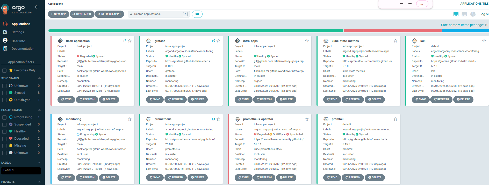
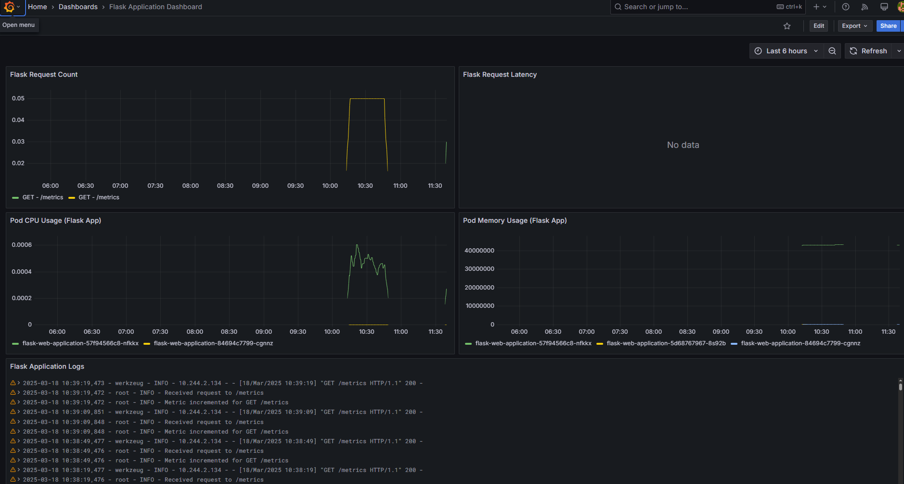

# GitOps Repository for Flask App & Infrastructure

## Overview
This repository is used to manage and deploy a **Flask application** and **infrastructure monitoring tools** using **ArgoCD** in a GitOps workflow. It automates deployments to a Kubernetes cluster and ensures that applications stay in sync with their configurations.

## Repository Structure
```
.gitops-repo-for-sample-apps/
│── flask-app-for-github-workflows/
│   ├── apps/
│   │   ├── flask-web-app/  # ArgoCD configuration for Flask app
│   ├── infra/
│   │   ├── argocd-apps/    # ArgoCD configuration for monitoring tools
└── argocd/                 # ArgoCD setup and configurations
```

## Applications
### **Flask Web Application**
- **Managed by ArgoCD**: `flask-application`
- **Project**: `flask-project`
- **Deployment Path**: `flask-app-for-github-workflows/apps/flask-web-app`
- **Namespace**: `production`
- **Auto-Sync**: Enabled (self-healing & pruning)

### **Infrastructure Monitoring (Grafana, Loki, Prometheus)**
- **Managed by ArgoCD**: `infra-apps`
- **Project**: `infra-apps-project`
- **Deployment Path**: `flask-app-for-github-workflows/infra/argocd-apps`
- **Namespaces**: `argocd`, `monitoring`, `kube-system`
- **Auto-Sync**: Enabled (self-healing & pruning)





## Deployment Instructions
### Prerequisites
- A **Kubernetes cluster** with **ArgoCD installed**.
- SSH access to the **Git repository**.


## Prerequisites

1. **Change gitops repository url in all argoCD applications**
```sh
find . -type f -exec sed -i 's|git@github.com:rafalzmyslony/gitops-repo-for-sample-apps.git|git@github.com:rafalzmyslony/<your gitops repository>.git|g' {} +
```

2. **Update all custom values**
- **S3 bucket name**: update `infra/monitoring/pull-logs-from-s3-and-push-to-loki-deployment.yml` to your S3 bucket name.  


### Deploy Applications to ArgoCD
1. Clone the repository:
   ```sh
   git clone git@github.com:rafalzmyslony/<your gitops repository>.git
   cd gitops-repo-for-sample-apps
   ```
2. Apply the **Entire infrastructure**:
   ```sh
   kubectl apply -f flask-app-for-github-workflows/argocd/
   ```

3. Verify the status in ArgoCD:
   ```sh
   argocd app list
   ```

## Auto-Sync & Self-Healing
- Any change in the Git repository will **automatically update deployments** in Kubernetes.
- If a deployment is changed manually, ArgoCD will **revert it back to match Git**.

## Troubleshooting
- Check ArgoCD UI (`argocd-server` service) for application status.
- Use `kubectl get pods -n <namespace>` to verify running applications.
- Run `argocd app sync <app-name>` to manually force a sync.

## Maintainer
Created and maintained by **Rafal Zmyslony**.

## License
This project is licensed under the **MIT License**.

